# Camp Microservices Demo

`camp` is a Java 17 minimum, Java 25 compatible Spring Cloud microservices training project. It demonstrates service discovery, API gateway routing, synchronous REST/OpenFeign calls, asynchronous Kafka-compatible eventing, Saga choreography, per-service databases, Redis caching, Elasticsearch search/log indexing, correlation IDs, Docker, Kubernetes, Swagger/OpenAPI, Postman collections, and SQL organization.

## Project Modules

| Module | Responsibility | Runtime Port |
| --- | --- | --- |
| `config-server` | Centralized Spring Cloud Config using native config repo | `8888` |
| `discovery-server` | Eureka service registry | `8761` |
| `auth-service` | OAuth2-style token issuing, JWT validation, refresh tokens, service credentials | `8087` |
| `api-gateway` | Spring Cloud Gateway edge routing and Swagger aggregation entry point | `8080` |
| `user-service` | User CRUD with MySQL and Redis cache | `8081` |
| `inventory-service` | Inventory reservation, rejection, and release | `8086` |
| `order-service` | Order creation, status management, outbox publishing, Saga listener | `8082` |
| `payment-service` | Kafka-driven payment processing and outbox publishing | `8083` |
| `notification-service` | Payment notification persistence | `8084` |
| `search-service` | Elasticsearch order/payment read model | `8085` |
| `common-events` | Shared event and API path contracts | N/A |
| `common-observability` | Correlation ID, Kafka headers, filters, interceptors, logging support | N/A |

## Overall System Architecture

The system is organized as independently deployable Spring Boot services. External clients enter through the API Gateway. Services use Eureka for discovery, Config Server for externalized configuration, MySQL for transactional data, Redis for user-service caching, Kafka-compatible Redpanda/Kafka for asynchronous domain events, and Elasticsearch for search and central log indexing.

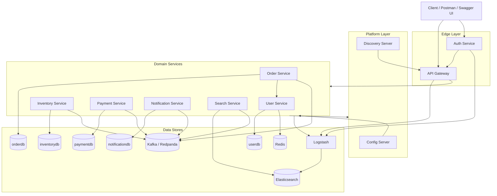

## High-Level Architecture

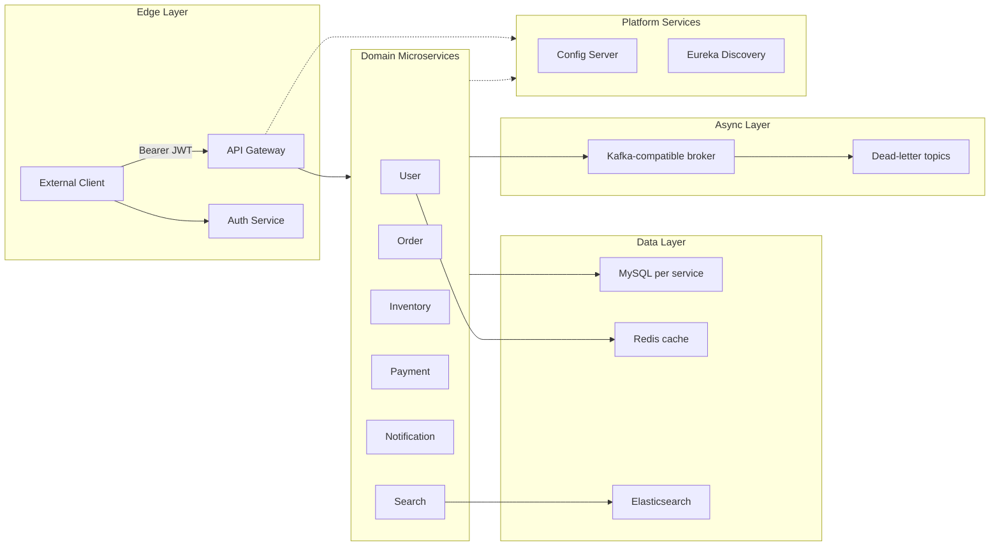

## Microservice Interaction Flow

Communication is intentionally mixed:

| Flow | Type | Services | Purpose |
| --- | --- | --- | --- |
| Client to Auth Service | Synchronous HTTP | Client -> Gateway -> Auth | OAuth2-style login, refresh, client credentials |
| Client to API Gateway | Synchronous HTTP | Client -> Gateway | External API entry with Bearer JWT |
| Gateway to services | Synchronous HTTP | Gateway -> domain services | Route API requests |
| Order user validation | Synchronous OpenFeign HTTP | Order -> User | Validate user before order creation with service Bearer token |
| Saga events | Asynchronous Kafka-compatible events | Order, Inventory, Payment, Notification, Search | Distributed transaction choreography |
| Log shipping | Asynchronous TCP JSON logs | Services -> Logstash -> Elasticsearch | Central logging |

Kafka topics:

| Topic | Producer | Consumers |
| --- | --- | --- |
| `order-created` | Order Service | Inventory Service, Search Service |
| `inventory-reserved` | Inventory Service | Payment Service, Order Service |
| `inventory-rejected` | Inventory Service | Order Service |
| `payment-processed` | Payment Service | Order Service, Notification Service, Search Service |
| `inventory-release-requested` | Order Service | Inventory Service |

Dead-letter topics use the `.DLT` suffix, for example `order-created.DLT`.

## Saga Choreography Workflow

The order workflow uses Saga choreography. There is no central Saga orchestrator. Each service reacts to events and publishes the next event.

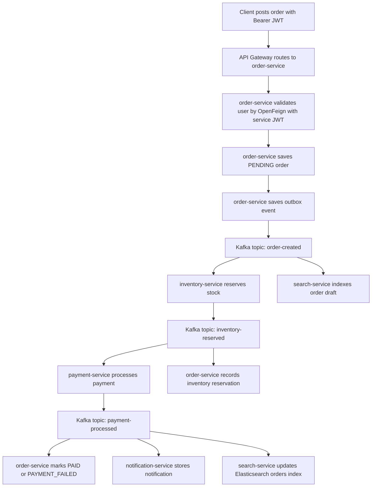

Compensation flow:

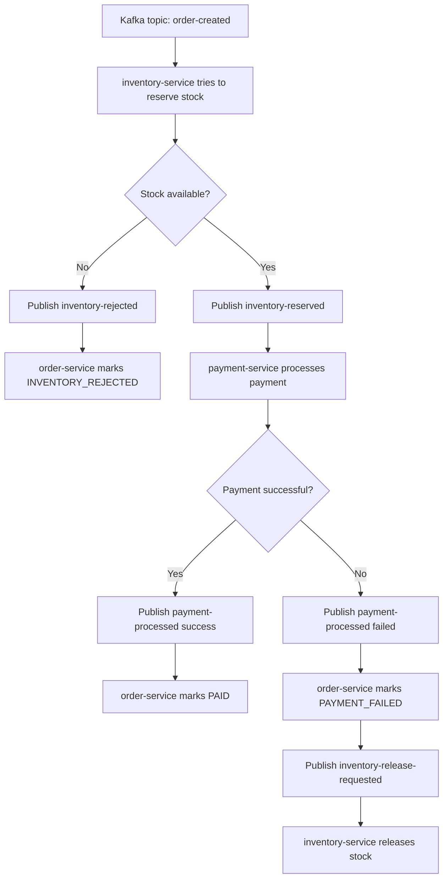

## Deployment Architecture

### Docker Compose

Docker Compose runs all infrastructure and application containers on a local Docker network. Host ports are adjusted to avoid conflicts with other local projects.

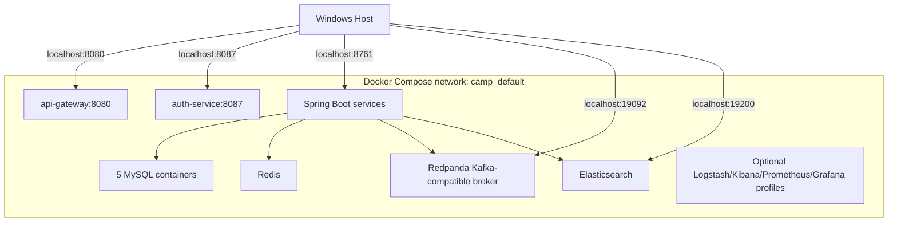

Important Docker host ports:

| Component | Host Port | Container Port |
| --- | ---: | ---: |
| API Gateway | `8080` | `8080` |
| Auth Service | `8087` | `8087` |
| Eureka | `8761` | `8761` |
| Config Server | `18888` | `8888` |
| User MySQL | `3307` | `3306` |
| Order MySQL | `3312` | `3306` |
| Payment MySQL | `3309` | `3306` |
| Notification MySQL | `3310` | `3306` |
| Inventory MySQL | `3311` | `3306` |
| Redis | `16379` | `6379` |
| Kafka-compatible broker | `19092` | `9092` |
| Elasticsearch | `19200` | `9200` |

### Kubernetes

Kubernetes manifests are under `k8s/` and deploy into the `camp` namespace.

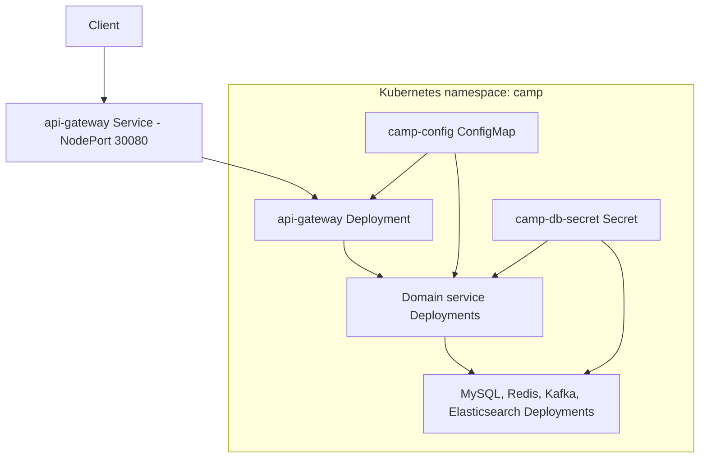

For local Docker Desktop Kubernetes, the application image tag is `camp/<service>:deploy`. For remote clusters, push these images to a registry and update `k8s/03-apps.yml`.

## Database Architecture And Relationships

Each microservice owns its database. Cross-service references such as `user_id`, `order_id`, and `product_id` are logical references, not cross-database foreign keys.

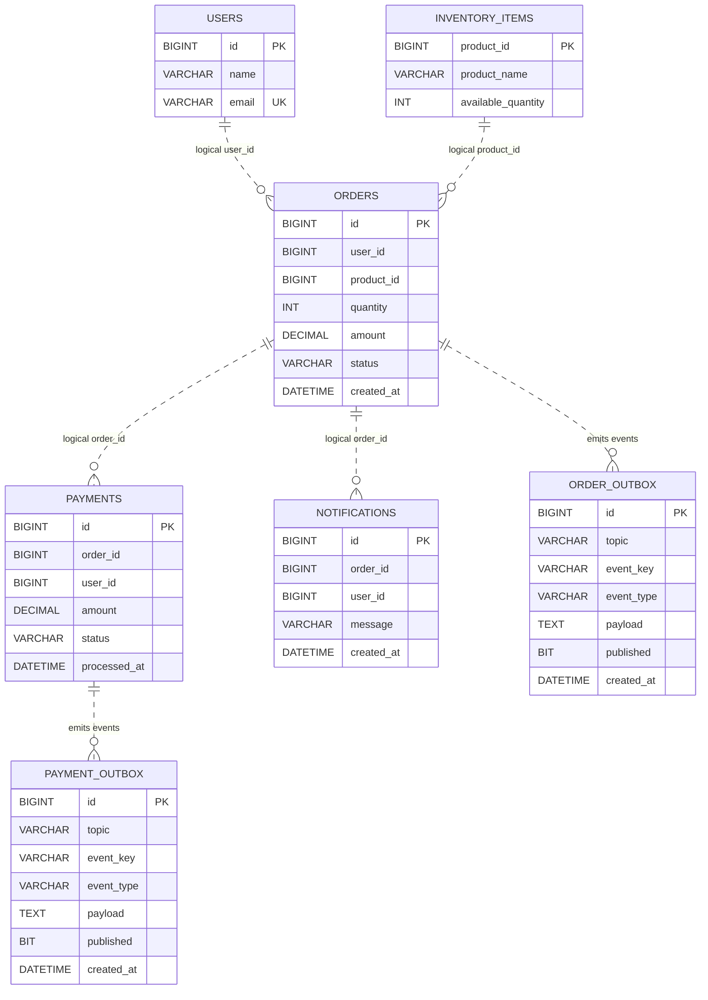

SQL scripts are organized by database under `D:\camp\sql`:

- `sql/userdb`
- `sql/inventorydb`
- `sql/orderdb`
- `sql/paymentdb`
- `sql/notificationdb`

Elasticsearch indexes:

- Application search index: `orders`
- Central logging indexes: `camp-{service_name}-YYYY.MM.dd`

## Security Architecture

### Implemented Security Status

The project now implements a lightweight OAuth2-style security model suitable for the training project. The implementation is intentionally simple and local: it uses an `auth-service` to issue HMAC-signed JWT access tokens, refresh tokens, and service tokens. The API Gateway validates Bearer tokens and enforces role checks before routing requests.

| Security Component | Implemented? | Current Status |
| --- | --- | --- |
| `auth-service` with OAuth 2.0 | Yes | `auth-service` exposes OAuth2-style `password`, `refresh_token`, and `client_credentials` grants |
| Bearer Token JWT authentication | Yes | Gateway requires `Authorization: Bearer <jwt>` for protected routes |
| Token validation mechanism | Yes | `common-security` validates JWT signature, expiry, token type, subject, and roles |
| Token refresh mechanism | Yes | `auth-service` rotates refresh tokens through `/api/v1/auth/token` with `grantType=refresh_token` |
| Role-Based Access Control (RBAC) | Yes | Gateway allows `USER`, `ADMIN`, and `SERVICE` roles based on path |
| Service-to-service authentication | Yes | `order-service` adds a signed service Bearer token to OpenFeign calls |
| API Gateway security integration | Yes | `GatewaySecurityFilter` validates JWTs and enforces RBAC before routing |
| Spring Security dependency/configuration | No | Security is custom/lightweight, not Spring Security based |

### Current Security Boundary

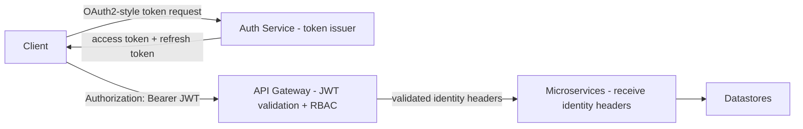

### Recommended Future Security Hardening

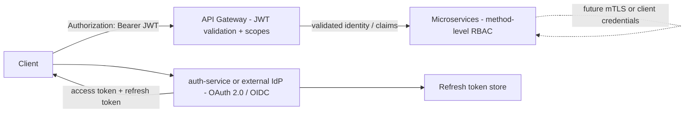

Recommended next hardening steps:

- Replace the local training auth-service with a standards-grade IdP such as Keycloak, Okta, Auth0, Azure AD, or Spring Authorization Server.
- Add Spring Security OAuth2 Resource Server on Gateway and services.
- Add method-level RBAC inside each service.
- Add mTLS or OAuth2 client credentials between all services.
- Store refresh tokens in a durable datastore instead of the in-memory training store.

## API Versioning Strategy

API paths are centralized in `common-events`:

```text
com.rajcloud.api.ApiResource
```

Current version constants:

```text
/api/v1
/api/v2
```

Current service paths:

| API | Path |
| --- | --- |
| Auth token | `/api/v1/auth/token` |
| Auth validation | `/api/v1/auth/validate` |
| Users | `/api/v1/users` |
| Inventory | `/api/v1/inventory` |
| Orders | `/api/v1/orders` |
| Payments | `/api/v1/payments` |
| Notifications | `/api/v1/notifications` |
| Search | `/api/v1/search/orders` |

Rules:

- Do not hardcode endpoint base paths in controllers.
- Use `ApiResource` constants for path consistency.
- Add `/api/v2` only for breaking API changes.
- Keep backward-compatible additions in `/api/v1`.

## Technology Stack

| Area | Technology |
| --- | --- |
| Language | Java 17 bytecode, Java 25 compatible runtime |
| Framework | Spring Boot 3.5.0 |
| Cloud stack | Spring Cloud 2025.0.0 |
| Security | Custom OAuth2-style auth-service, HMAC JWT, Gateway RBAC |
| Gateway | Spring Cloud Gateway |
| Discovery | Netflix Eureka |
| Config | Spring Cloud Config Server |
| Persistence | Spring Data JPA, MySQL 8.4 |
| Cache | Redis |
| Messaging | Kafka API via Redpanda/Kafka |
| Search | Elasticsearch 8.15.3 |
| Logging | Logback JSON, Logstash, Elasticsearch |
| Metrics | Spring Actuator, Prometheus, Grafana |
| API docs | springdoc OpenAPI / Swagger UI |
| Tests | JUnit 5, Mockito, JaCoCo |
| Containerization | Docker, Docker Compose |
| Orchestration | Kubernetes manifests |
| API testing | Postman collections under `postman/` |

## Environment Setup

Prerequisites:

- Windows with PowerShell
- Java 17 or newer
- Maven 3.9 or newer
- Docker Desktop
- Kubernetes enabled in Docker Desktop, or another Kubernetes cluster
- `kubectl`

Recommended checks:

```powershell
java -version
mvn -version
docker version
kubectl version --client=true
kubectl config current-context
```

## Build And Test

Run the full build with tests and 100% JaCoCo instruction coverage gate:

```powershell
cd D:\camp
mvn verify
```

Package jars without tests:

```powershell
cd D:\camp
mvn clean package -DskipTests
```

## Docker Build And Deployment

Build and start all infrastructure and application containers:

```powershell
cd D:\camp
mvn clean package -DskipTests
docker compose --profile apps up -d --build
```

Check status:

```powershell
docker compose ps
```

Gateway:

```text
http://localhost:8080
```

Auth token endpoint:

```text
http://localhost:8080/api/v1/auth/token
```

Swagger:

```text
http://localhost:8080/swagger-ui.html
```

Stop:

```powershell
docker compose --profile apps down
```

Optional observability containers:

```powershell
docker compose --profile observability up -d
```

## Kubernetes Build And Deployment

Build local images:

```powershell
cd D:\camp
mvn clean package -DskipTests
.\scripts\build-images.ps1
```

For Docker Desktop Kubernetes, ensure app images use the local deployment tag:

```powershell
docker tag camp/config-server:latest camp/config-server:deploy
docker tag camp/discovery-server:latest camp/discovery-server:deploy
docker tag camp/auth-service:latest camp/auth-service:deploy
docker tag camp/api-gateway:latest camp/api-gateway:deploy
docker tag camp/user-service:latest camp/user-service:deploy
docker tag camp/inventory-service:latest camp/inventory-service:deploy
docker tag camp/order-service:latest camp/order-service:deploy
docker tag camp/payment-service:latest camp/payment-service:deploy
docker tag camp/notification-service:latest camp/notification-service:deploy
docker tag camp/search-service:latest camp/search-service:deploy
```

Deploy:

```powershell
kubectl apply -f D:\camp\k8s\00-namespace.yml
kubectl apply -f D:\camp\k8s\01-config.yml
kubectl apply -f D:\camp\k8s\02-infra.yml
kubectl apply -f D:\camp\k8s\03-apps.yml
```

Check status:

```powershell
kubectl get pods -n camp -o wide
kubectl get svc -n camp
```

Gateway NodePort:

```text
http://localhost:30080
```

Swagger through Kubernetes:

```text
http://localhost:30080/swagger-ui.html
```

Delete Kubernetes deployment:

```powershell
kubectl delete namespace camp
```

## Swagger And Postman

Swagger UI through Gateway:

```text
http://localhost:8080/swagger-ui.html
```

Direct service Swagger UIs:

```text
http://localhost:8081/swagger-ui.html
http://localhost:8082/swagger-ui.html
http://localhost:8083/swagger-ui.html
http://localhost:8084/swagger-ui.html
http://localhost:8085/swagger-ui.html
http://localhost:8086/swagger-ui.html
```

Postman collections and environments are grouped by service under:

```text
D:\camp\postman
```

## Authentication Examples

Get an admin access token:

```powershell
Invoke-RestMethod -Method Post http://localhost:8080/api/v1/auth/token `
  -ContentType "application/json" `
  -Body '{"grantType":"password","username":"admin","password":"admin123"}'
```

Get a user access token:

```powershell
Invoke-RestMethod -Method Post http://localhost:8080/api/v1/auth/token `
  -ContentType "application/json" `
  -Body '{"grantType":"password","username":"user","password":"user123"}'
```

Refresh an access token:

```powershell
Invoke-RestMethod -Method Post http://localhost:8080/api/v1/auth/token `
  -ContentType "application/json" `
  -Body '{"grantType":"refresh_token","refreshToken":"<refresh-token>"}'
```

Get a service token:

```powershell
Invoke-RestMethod -Method Post http://localhost:8080/api/v1/auth/token `
  -ContentType "application/json" `
  -Body '{"grantType":"client_credentials","clientId":"camp-service","clientSecret":"camp-service-secret"}'
```

Use a protected API:

```powershell
Invoke-RestMethod -Method Get http://localhost:8080/api/v1/orders `
  -Headers @{ Authorization = "Bearer <access-token>" }
```

## Observability

Implemented:

- `X-Correlation-Id` generation for missing inbound HTTP requests.
- Correlation ID propagation in HTTP, Feign, Kafka headers, and JSON logs.
- Structured JSON log fields.
- Kafka dead-letter topics.
- Elasticsearch log index naming strategy.
- Actuator endpoints.

More detail:

```text
D:\camp\docs\observability-logging.md
```

## Key Workflow Sequence Diagrams

### Create User

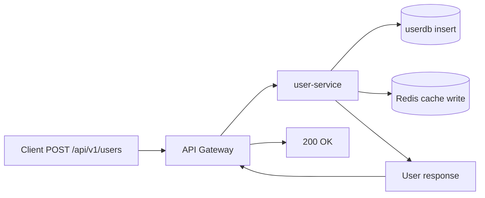

### Create Order

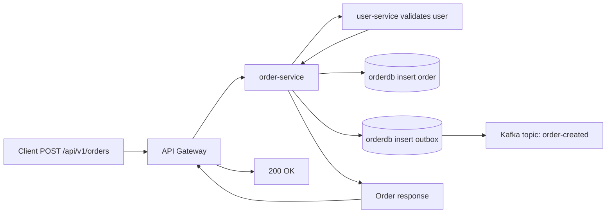

### Inventory Reservation

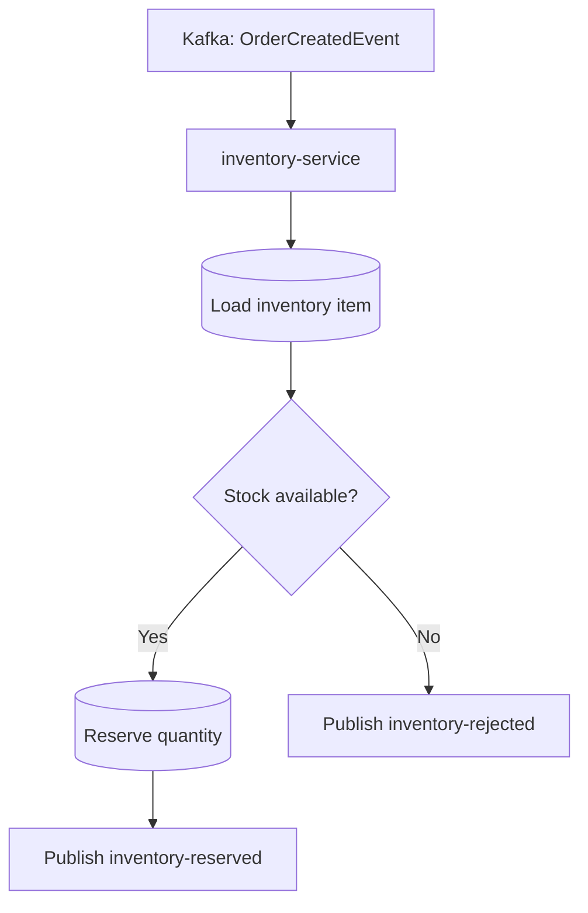

### Payment And Notification

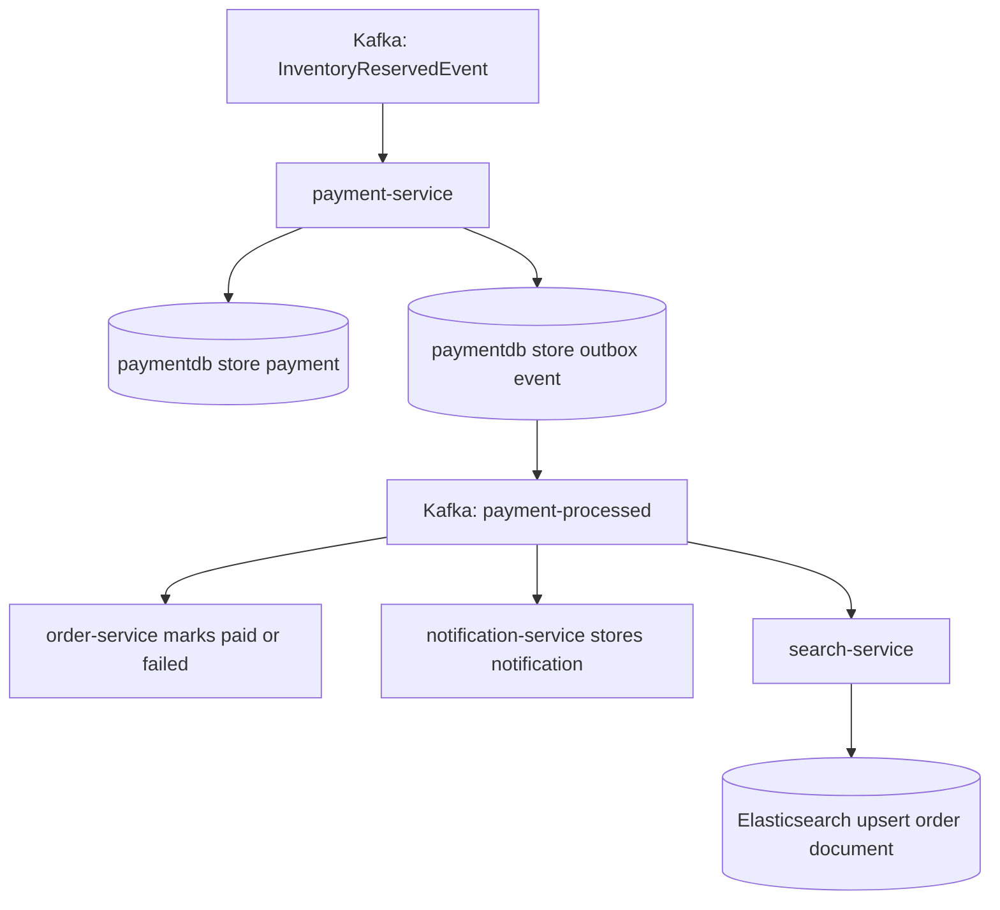

### Correlation ID Propagation

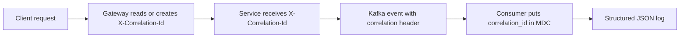

## Important Notes

- `kube-proxy` is not implemented in the application. Kubernetes provides service routing through the cluster networking layer.
- Logstash and Kibana are documented and configured, but may be run as optional local components depending on image availability.
- Security is implemented for the training scope with JWT Bearer tokens, Gateway RBAC, refresh tokens, and service tokens.
- The project enforces 100% JaCoCo instruction coverage during `mvn verify`.
